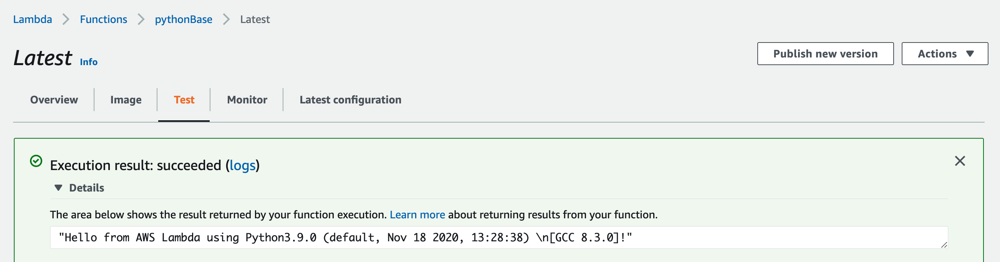

### Note !!! 
- for easy to setting, please put your python application in app/ dir. (or you can use my sample code ...)

### For build image
```bash
docker build -t lambda-python-debian .
```

### For local testing
#### Please download Lambda Runtime Interface Emulator in your home dir
```bash
mkdir -p ~/.aws-lambda-rie
curl -Lo ~/.aws-lambda-rie/aws-lambda-rie https://github.com/aws/aws-lambda-runtime-interface-emulator/releases/latest/download/aws-lambda-rie
chmod +x ~/.aws-lambda-rie/aws-lambda-rie
```
and then 
```bash
                                                                        #or your <app-name>"<handler-function-name> 
docker run -it -v ~/.aws-lambda-rie/aws-lambda-rie:/usr/bin/aws-lambda-rie --entrypoint /entry.sh \
-p 9000:8080 lambda-python-debian app.handler
```
and invocation with cURL
```bash
curl -XPOST "http://localhost:9000/2015-03-31/functions/function/invocations" -d '{}'

---
output
"Hello from AWS Lambda using Python3.9.0 (default, Nov 18 2020, 13:28:38) \n[GCC 8.3.0]!"
```

you also can push to ECR and create the function.  Here’s my test in the console:



